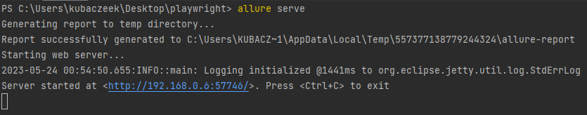

# Automation [interviewme](https://app.interviewme.pl/) app with Playwright 

## Technologies

- [Playwright](https://playwright.dev)
- [Typescript](https://www.typescriptlang.org/)
- [Allure Reports](https://docs.qameta.io/allure/)

## Installation
- Navigate to the folder with downloaded repo and install npm packages:
```bash
- npm install
```

- Install Playwright browsers
```bash
- npx @playwright/test install
```

## Usage

- Before running test specify which language we are going to test. Example for polish below:
```bash
$env:LANGUAGE=1
```

- Run prepared spec file interview.spec.ts
```bash
npx playwright test tests/interview/interview.spec.ts
```

- Allure needs to be added to your system PATH. To generate allure report: 
```bash
allure serve
```

